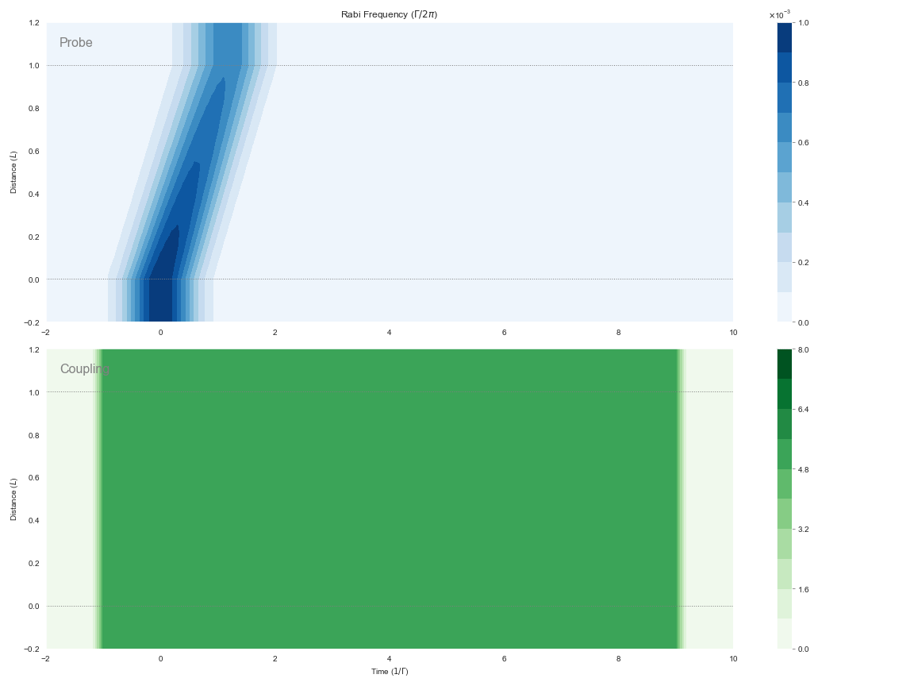
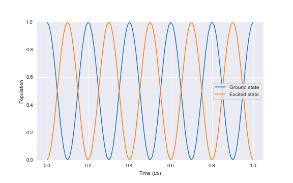
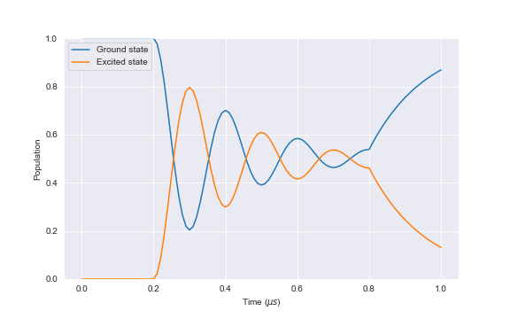

# Notebooks on MaxwellBloch

A set of Jupyter Notebooks on the [MaxwellBloch](https://github.com/tommyogden/maxwellbloch/) package.

> MaxwellBloch is a Python package for solving the coupled Maxwell-Bloch
> equations describing the nonlinear propagation of near-resonant light through
> thermal atomic vapours.

## Examples

### Solve the Maxwell-Bloch Equations for a Two-Level System

#### Weak Gaussian Pulses

| Notebook | Output |
| --- | --- |
| [Weak Pulse through Very Few Atoms][wpvfa] | 
| [Weak Pulse through Few Atoms][wpfa] | 
| [Weak Pulse through Some Atoms][wpsa] |  |
| [Weak Pulse through More Atoms][wpma] |  |
| [Weak Pulse through Few Atoms with Decay][wpfad] |  |
| [Weak Pulse through Some Atoms with Decay][wpsad] |  |

#### Weak Square Pulses

| Notebook | Output |
| --- | --- |
| [Weak Square through Few Atoms][wsfa] | ![][wsfa-image] |
| [Weak Square through Few Atoms with Decay][wsfad] | ![][wsfad-image] |

<!-- | [Weak Pulse through Few Atoms with Decay, More Time Steps][wpsadt] |  | -->

#### Weak Continuous

| Notebook | Output |
| --- | --- |
| [Weak CW through Few Atoms][wcfad] | ![][wcfad-image] |
| [Weak CW through Some Atoms][wcsad] | ![][wcsad-image] |
| [Weak CW through Few Atoms, Long Time][wcfadl] | ![][wcfadl-image] |
| [Weak CW through Some Atoms, Long Time][wcsadl] | ![][wcsadl-image] |

[wcfad]: examples/mb-solve-two-weak-cw-few-atoms-decay.ipynb
[wcfad-image]: examples/images/mb-solve-two-weak-cw-few-atoms-decay.png
[wcsad]: examples/mb-solve-two-weak-cw-some-atoms-decay.ipynb
[wcsad-image]: examples/images/mb-solve-two-weak-cw-some-atoms-decay.png

[wcfadl]: examples/mb-solve-two-weak-cw-few-atoms-decay-long.ipynb
[wcfadl-image]: examples/images/mb-solve-two-weak-cw-few-atoms-decay-long.png
[wcsadl]: examples/mb-solve-two-weak-cw-some-atoms-decay-long.ipynb
[wcsadl-image]: examples/images/mb-solve-two-weak-cw-some-atoms-decay-long.png

#### Solitons

| Notebook | Output |
| --- | --- |
| [0.8π Gaussian Pulse][gaus-0.8] | ![][gaus-0.8-png] |
| [1.8π Gaussian Pulse][gaus-1.8] | ![][gaus-1.8-png] |
| [2π Sech Pulse: Self-Induced Transparency][sech-2] | ![][sech-2-png] |
| [4π Sech Pulse: Breakup][sech-4] | ![][sech-4-png] |
| [6π Sech Pulse][sech-6] | ![][sech-6-png] |
| [2π Sech Pulse with Decay][sech-2d] | ![][sech-2d-png] |
| [Two 2π Sech Pulse Collision][sech-2c] | ![][sech-2c-png] |

[gaus-0.8]: examples/mb-solve-two-gaussian-0.8pi.ipynb
[gaus-0.8-png]: examples/images/mb-solve-two-gaussian-0.8pi.png
[gaus-1.8]: examples/mb-solve-two-gaussian-1.8pi.ipynb
[gaus-1.8-png]: examples/images/mb-solve-two-gaussian-1.8pi.png

[sech-2]: examples/mb-solve-two-sech-2pi.ipynb
[sech-2-png]: examples/images/mb-solve-two-sech-2pi.png
[sech-4]: examples/mb-solve-two-sech-4pi.ipynb
[sech-4-png]: examples/images/mb-solve-two-sech-4pi.png
[sech-6]: examples/mb-solve-two-sech-6pi.ipynb
[sech-6-png]: examples/images/mb-solve-two-sech-6pi.png

[sech-2d]: examples/mb-solve-two-sech-2pi-narrower-even-more-atoms-decay.ipynb
[sech-2d-png]: examples/images/mb-solve-two-sech-2pi-narrower-even-more-atoms-decay.png
[sech-2c]: examples/mb-solve-two-sech-2pi-collision.ipynb
[sech-2c-png]: examples/images/mb-solve-two-sech-2pi-collision.png

### Solve the Maxwell-Bloch Equations for a Λ-Type System

| Notebook | Output |
| --- | --- |
| [Weak Pulse, No Coupling: Same as Two-Level][wpnc] |  |
| [Weak Pulse, Some Coupling: Electromagnetically Induced Transparency][wpsc] |  |
| [Pulse Compression][pc] |  |
| [Storage and Retrieval][store] |  |

### Solve the Maxwell-Bloch Equations for a V-Type System

| Notebook | Output |
| --- | --- |
| [0.5π Sech Pulse, 0.5π Coupling][vsech-0.5-0.5] |  |
| [0.5π Sech Pulse, 1.5π Coupling: Simulton][vsech-0.5-1.5] |  |
| [√2π Sech Pulse, √2π Coupling: Simulton][vsech-1.41-1.41] |  |
| [√8π Sech Pulse, √8π Coupling: Double Simulton][vsech-2.83-2.83] |  |
| [√18π Sech Pulse, √18π Coupling: Triple Simulton][vsech-r18-r18] |  |
| [Weak CW, √2π Coupling: Optical Surfer][v-wc-sech2] |  |
| [Weak CW, √4π Coupling: Double Optical Surfer][v-wc-sech4] |  |

<!--| [0.5π Sech Pulse, No Coupling][vsech-0.5] |  |-->
<!--| [2.0π Sech Pulse, No Coupling][vsech-2] |  |-->

### Solve the Maxwell-Bloch Equations for a Ladder-Type System

| Notebook | Output |
| --- | --- |
| [Weak Pulse, Some Coupling, Decay, Detuning][ladder-wpsc] |  |

[ladder-wpsc]: examples/mb-solve-ladder-weak-pulse-more-atoms-some-coupling-decay.ipynb

### Solve the Optical Bloch Equations

| Notebook | Output |
| --- | --- |
| [Rabi Oscillations in a Two-Level System][03] |  |
| [Time-Dependent Interaction with a Two-Level System][04] |  |
| [Two-Level System with Spontaneous Decay][05] |  |
| [The Lambda-Type Three-Level System][06] |  |

## Tutorial

| Notebook |
| --- |
| [00: Solve the Schrödinger Equation for the Two-Level System][00] |
| [01: Solve the Two-Level System with a Time-Dependent Interaction][01] |
| [02: Solve the Optical Bloch Equations with Spontaneous Decay][02] |
| More on the way…

###  Appendices

| Notebook | Output |
| --- | --- |
| [A: Available Time Functions][A] |  |
| [B: Shifting a Solution to the Fixed Frame of Reference][B] |  |
| [C: Spectral Analysis][C] | 

<!-- Links -->

[00]: tutorial/00-solve-the-schroedinger-equation-for-the-two-level-system.ipynb
[01]: tutorial/01-solve-the-two-level-system-with-time-dependent-interaction.ipynb
[02]: tutorial/02-solving-the-optical-bloch-equations.ipynb

<!--OB Solve-->

[03]: examples/ob-solve-two-rabi-oscillations.ipynb
[04]: examples/ob-solve-two-tfunc-square.ipynb
[05]: examples/ob-solve-two-tfunc-square-decay.ipynb

[06]: examples/ob-solve-lamda-on-resonance.ipynb

<!--Two-level-->
<!-- Pulses -->

[wpvfa]: examples/mb-solve-two-weak-pulse-very-few-atoms.ipynb
[wpfa]: examples/mb-solve-two-weak-pulse-few-atoms.ipynb
[wpsa]: examples/mb-solve-two-weak-pulse-some-atoms.ipynb
[wpma]: examples/mb-solve-two-weak-pulse-more-atoms.ipynb
[wpfad]: examples/mb-solve-two-weak-pulse-few-atoms-decay.ipynb
[wpsad]: examples/mb-solve-two-weak-pulse-some-atoms-decay.ipynb
[wpsadt]: examples/mb-solve-two-weak-pulse-few-atoms-decay-more-tsteps.ipynb

[wsfa]: examples/mb-solve-two-weak-square-few-atoms.ipynb
[wsfa-image]: examples/images/mb-solve-two-weak-square-few-atoms.png
[wsfad]: examples/mb-solve-two-weak-square-few-atoms-decay.ipynb
[wsfad-image]: examples/images/mb-solve-two-weak-square-few-atoms-decay.png

<!-- Continuous -->

<!--Lambda-->

[wpnc]: examples/mb-solve-lambda-weak-pulse-more-atoms-no-coupling.ipynb
[wpsc]: examples/mb-solve-lambda-weak-pulse-more-atoms-some-coupling.ipynb
[pc]: examples/mb-solve-lambda-weak-pulse-cloud-atoms-some-coupling.ipynb
[store]: examples/mb-solve-lambda-weak-pulse-cloud-atoms-some-coupling-store.ipynb

<!--Vee-->
<!--[vsech-0.5]: examples/mb-solve-vee-sech-0.5pi.ipynb-->
<!--[vsech-2]: examples/mb-solve-vee-sech-2pi.ipynb-->

[vsech-0.5-0.5]: examples/mb-solve-vee-sech-0.5pi-0.5pi.ipynb
[vsech-0.5-1.5]: examples/mb-solve-vee-sech-0.5pi-1.5pi.ipynb
[vsech-1.41-1.41]: examples/mb-solve-vee-sech-1.41pi-1.41pi.ipynb
[vsech-2.83-2.83]: examples/mb-solve-vee-sech-2.83pi-2.83pi.ipynb
[vsech-r18-r18]: examples/mb-solve-vee-sech-root18pi-root18pi.ipynb
[v-wc-sech2]: examples/mb-solve-vee-weak-cw-sech-2pi.ipynb
[v-wc-sech4]: examples/mb-solve-vee-weak-cw-sech-4pi.ipynb

[A]: appendices/A-available-time-functions.ipynb
[B]: appendices/B-mb-solve-fixed-frame.ipynb
[C]: appendices/C-spectral-analysis.ipynb

<!-- [B]: B-loading-from-json-and-saving-qu.ipynb -->

[ff]: https://www.ffmpeg.org/
